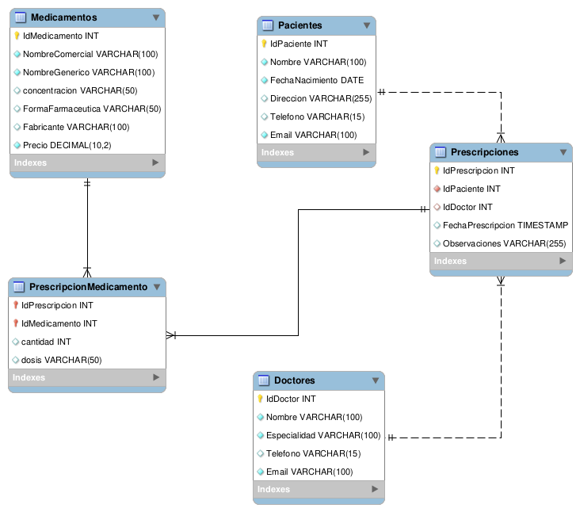

# Medicamentos API

Este proyecto implementa una API RESTful para la gestión de medicamentos, con soporte para operaciones CRUD (Create, Read, Update, Delete) utilizando ASP.NET 8 y MySQL como base de datos.


## Descripción

Esta API RESTful permite gestionar un catálogo de medicamentos, con funcionalidades para:

- GET /api/Medicamentos: Obtener todos los medicamentos.

- GET /api/Medicamentos/{id}: Obtener un medicamento por su ID.

- POST /api/Medicamentos: Crear un nuevo medicamento.

- PUT /api/Medicamentos: Actualizar la información de un medicamento.

- DELETE /api/Medicamentos/{id}: Eliminar un medicamento.


## Requsitos previos

Antes de empezar asegúrate de tener instalados los siguientes requisitos:

- [.Net SDK](https://dotnet.microsoft.com/en-us/download)
- [MySQL](https://dev.mysql.com/downloads/mysql/)


## Instalación

Clona este repositorio

```bash
  git clone https://link-to-project
```

Restaura los paquetes NuGet:

```bash
  dotnet restore
```


## Configuración de base de datos

1. Asegúrate de tener una base de datos MySQL corriendo localmente.

2. Configura la cadena de conexión en el archivo appsettings.json:

```json
  "ConnectionStrings": {
  "DefaultConnection": "server=localhost;port=3306;database=recetas_medicas;user=root;password=;"
}

```
3. Protege la contraseña de tu servidor de BD usando el Secret Manager:

```bash
dotnet user-secrets init
dotnet user-secrets set "DBPassword" "tucontraseña"
```    
## Estrcutura de base de datos

Ejemplo del objeto JSON que represente la información del medicamento:

```json
  {
    "idMedicamento": 1,
    "nombreComercial": "Ibuprofeno",
    "nombreGenerico": "Ibuprofeno",
    "concentracion": "400 mg",
    "formaFarmaceutica": "Tableta",
    "fabricante": "Laboratorio XYZ",
    "precio": 2500.5
  }

```
Aqui encuentras el diagrama del modelo relacional de la base de datos:




## Autor

- [@arizamoisesco](https://www.github.com/arizamoisesco)
